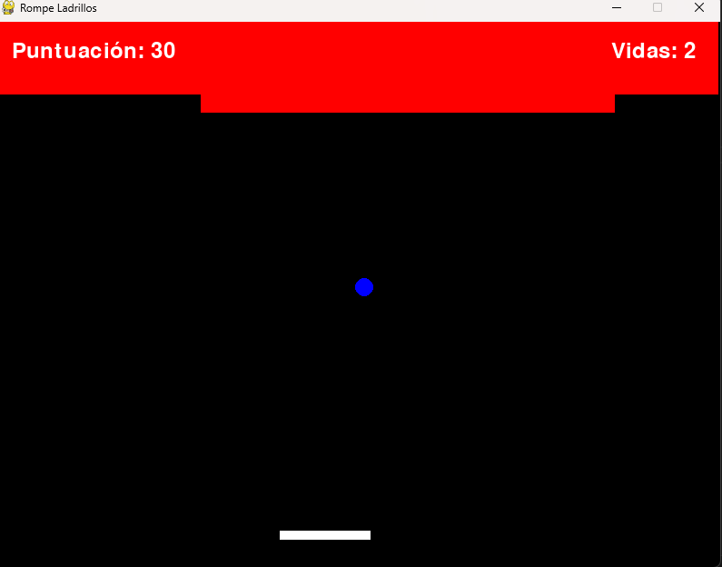

# Brick-Breaker en Python con Pygame 🧱🎮

## Descripción

**Brick-Breaker en Python con Pygame** es una recreación del clásico juego Brick-Breaker desarrollado en Python utilizando la biblioteca [Pygame](https://www.pygame.org/). 

## Tecnologías Utilizadas

- **Lenguaje de Programación:** Python Python 3.12.4
- **Biblioteca Gráfica:** Pygame 2.1.2 o superior

## Requisitos

Antes de ejecutar el juego, asegúrate de tener instalados los siguientes requisitos:

- **Python 3.6 o superior**
- **Pygame 2.1.2 o superior**

### Clonar el Repositorio
    git clone https://github.com/moises60/brick-breaker.git

### Acceder a la Carpeta
    cd brick-breaker
    
### Ejecutar el Juego
    python3 main.py